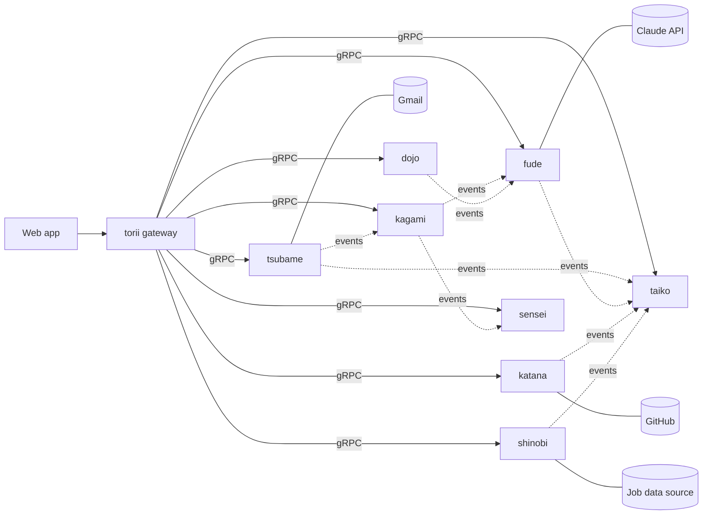

# Shogun HLD

Oct 1, 2026 · @sboy99

> Service names in this file are the final Japanese names (the original HLD doc used plain names: tracker is kagami, mail is tsubame, drafter is fude, notifications is taiko, learning is dojo, profile is katana, discovery is shinobi, insights is sensei, and the gateway is torii). The cost-control service `soroban` was added after the HLD and is specified in `shogun-lld.md`.

## System at a glance

The web app only talks to the gateway; the gateway calls the services over gRPC. Services never read each other's tables and share state only through gRPC calls and events. The notification centre (taiko) is fed by events, and the outside systems are each reached by exactly one service.

## Services

Eight Go services, each with one job and its own Postgres schema. No service reads another service's tables; they talk over gRPC or through events.

| Service | Responsibility | Owns |
| --- | --- | --- |
| `kagami` | Jobs, contacts and their timelines; follow-up dates; add-contact form and CSV import | Schema `kagami`: companies, jobs, job_events, contacts, contact_events |
| `tsubame` | Gmail connection, mail sync, job-mail classification, the only sender of email | Schema `tsubame`: email messages, provider tokens (encrypted) |
| `fude` | All text generation through the Claude API: cover letters, outreach, posts; draft versions; the approval queue | Schema `fude`: drafts, draft_versions, voice_samples (with embeddings) |
| `taiko` | Turns events into notifications; read or unread state; delivery channels | Schema `taiko`: notifications, channel settings |
| `dojo` | Learning items and activities; triggers post generation | Schema `dojo`: items, activities |
| `katana` | GitHub sync; resume and LinkedIn suggestions | Schema `katana`: suggestions, github_snapshots |
| `shinobi` | Pulls postings from the data source you provide; scores them against your preferences | Schema `shinobi`: sources, postings, preferences, scores |
| `sensei` | Read-only analytics: rates by source, outreach reply rates | Schema `sensei`: aggregated events, report snapshots |

**APIs and events** (high level; the full `.proto` files come with each milestone)

| Service | gRPC API | Publishes | Consumes |
| --- | --- | --- | --- |
| `kagami` | Jobs and contacts CRUD, ImportContacts, ListDueFollowUps | `job.added`, `job.status_changed`, `contact.status_changed` | `mail.classified` (updates job status), `draft.sent` (advances contact status) |
| `tsubame` | Connect, ListMessages, CreateDraft, Send (needs approval token) | `mail.classified`, `mail.reply_detected`, `draft.sent` | none |
| `fude` | GenerateDraft, Regenerate, Approve, Discard, ListQueue | `draft.ready`, `draft.failed`, `draft.approved` | `job.added` (cover letter), `contact.status_changed` (outreach draft), `learning.activity_added` (post draft) |
| `taiko` | Publish, List, MarkRead, Subscribe (stream) | none | every `*.ready`, `*.failed`, `mail.classified`, `discovery.match_found` |
| `dojo` | Items and activities CRUD, GeneratePost | `learning.activity_added`, `learning.item_completed` | none |
| `katana` | SyncGitHub, ListSuggestions, Accept, Dismiss | `profile.suggestion_ready` | `learning.item_completed` |
| `shinobi` | ConfigureSource, ListPostings, SaveToTracker | `discovery.match_found` | none |
| `sensei` | GetFunnel, GetOutreachStats | none | `job.*`, `contact.*`, `mail.*`, `draft.sent` |

## Events and the approval token

**Events.** A service writes an event to an outbox table in its own schema in the same transaction as the change it describes. A River job reads the outbox and delivers the event to every subscriber, retrying on failure, so an event is never lost if a service restarts. Consumers must handle the same event twice without harm (events carry a unique id).

**Approval token.** Anything that leaves the system goes through one gate, and only you can open it.

1. `fude` stores the draft with state `pending`. Nothing leaves at this point.
2. You review it in the app, and may edit it or regenerate it with more context. Each change creates a new version.
3. You press Approve in the UI. The gateway checks your login session and tells `fude` to approve that exact draft version.
4. `fude` signs a short-lived token holding the draft id, the version, a hash of the body and an expiry (a few minutes), and sends it to `tsubame` with the message.
5. `tsubame` verifies the signature, expiry and body hash, and refuses to send if any of them fails. If all pass, it sends through Gmail once; the token is single use.
6. `tsubame` publishes `draft.sent`. `kagami` moves the contact to the next status.

Editing a draft after approval changes its hash, so the old token stops working. No worker, schedule or AI step can create a token, because the signing key is used only by the approve call in `fude`. Posts for LinkedIn or X never enter this path: the app only offers a copy button.

## Key flows

**Add a job, get a cover letter, get notified**

1. You add a job in the UI. The gateway calls `kagami.AddJob`, which stores it and writes a `job.added` event to its outbox.
2. The event reaches `fude`, which queues a cover letter job and returns immediately, so adding the job never waits on the AI.
3. The background job gathers the job description, your background and your voice samples, calls the Claude API, and saves the result as a draft with state `pending`.
4. `fude` publishes `draft.ready` (or `draft.failed` if generation did not work after retries).
5. `taiko` stores a notification, "Cover letter ready for <role> at <company>", and pushes it to the open app over the `Subscribe` stream, so the bell updates live.
6. You click the notification, which opens the draft in the approval queue. Nothing is sent.

**Contact status to draft, approve, send**

1. A contact's status changes, either because you set it or because `tsubame` detected a reply. `kagami` publishes `contact.status_changed`.
2. `fude` picks the draft template for the new status (cold DM for not reached, nudge for reached out, and so on), generates the message and saves it as `pending`. `taiko` tells you a draft is waiting.
3. You open the draft and either approve it, edit it, or regenerate it with more context. Regeneration creates a new version and repeats from the AI call.
4. On approve, the approval token flow above runs and `tsubame` sends the email. For channels with no API, such as a LinkedIn DM, you copy the text and send it yourself, then mark the contact as reached out.
5. `tsubame` publishes `draft.sent`; `kagami` updates the contact status and last contacted date, and `sensei` records the outreach for reply-rate stats.
