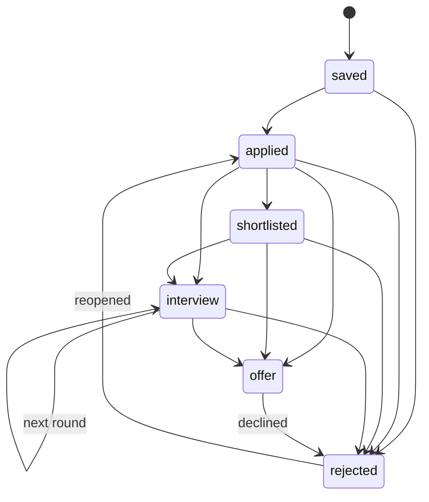
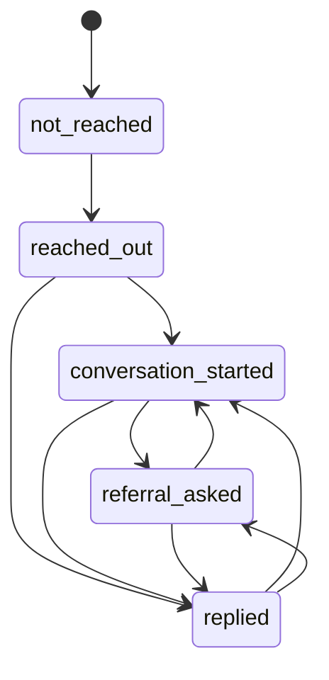
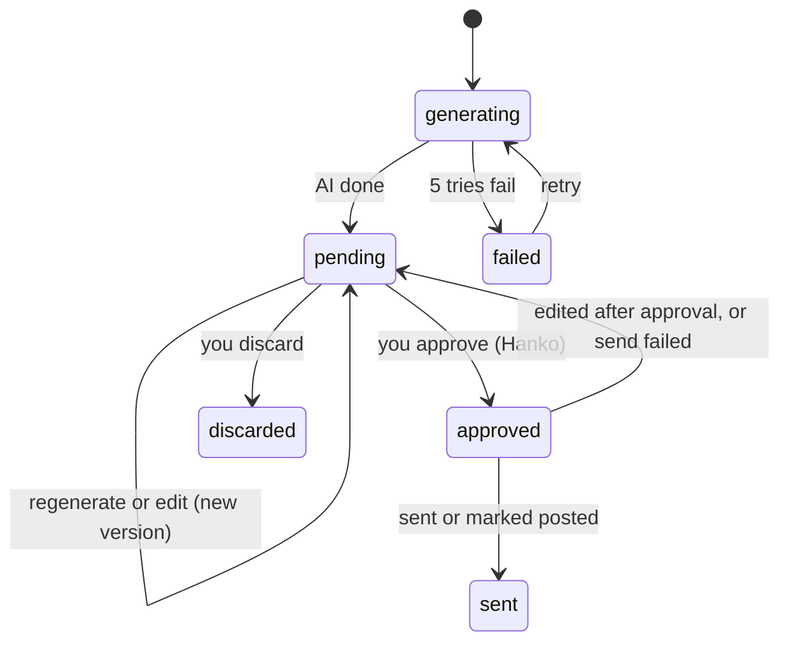
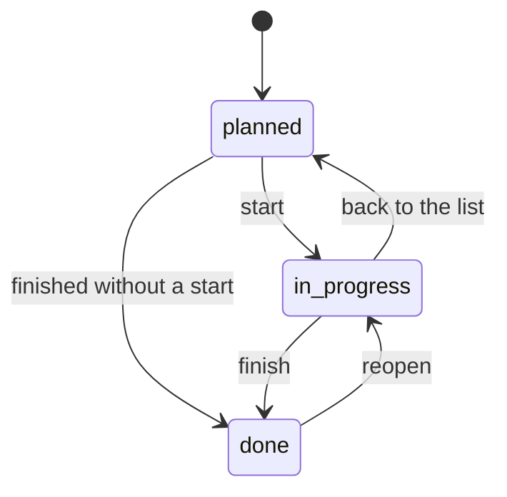

# Shogun state machines

Source: the "State machines" section of the Shogun System Design doc. Each lifecycle lives in `internal/domain` as a transition table. Any move not listed returns `FailedPrecondition` with reason `<ENTITY>_INVALID_TRANSITION`. Every accepted move writes an `*_events` row and a `*.status_changed` event.

## Job (kagami)

| From | Allowed to | Who moves it |
| --- | --- | --- |
| saved | applied, rejected | you; `mail.classified = application_confirmation` moves saved to applied |
| applied | shortlisted, interview, rejected, offer | you; mail classification suggests, auto-applies only at confidence ≥ 0.9 |
| shortlisted | interview, rejected, offer | you, or mail classification |
| interview | interview (next round), offer, rejected | you, or mail classification |
| offer | rejected (declined) | you |
| rejected | applied (reopened) | you only |

Any automatic move below 0.9 confidence becomes a notification with one-tap Accept instead of a change.

## Contact (kagami)

| From | Allowed to | Who moves it |
| --- | --- | --- |
| not_reached | reached_out | `draft.sent` for this contact, or you after a manual DM |
| reached_out | conversation_started, replied | `mail.reply_detected` sets replied; you set conversation_started |
| replied | conversation_started, referral_asked | you, or `draft.sent` of a referral draft |
| conversation_started | referral_asked, replied | you, or `draft.sent` of a referral draft |
| referral_asked | replied, conversation_started | `mail.reply_detected`, or you |

Every move into a new status fires `contact.status_changed`, which makes fude queue the matching template's draft (cold DM, nudge, referral ask). Status never moves backwards automatically.

## Draft (fude)

| From | Allowed to | Trigger |
| --- | --- | --- |
| generating | pending | AI generation finished |
| generating | failed | 5 tries failed; `draft.failed` is emitted |
| failed | generating | retry |
| pending | pending | regenerate or edit creates a new version |
| pending | approved | you approve the newest version; fude stamps a Hanko for that version's hash |
| pending | discarded | you discard |
| approved | sent | `tsubame.Send` succeeded (email), or you mark a copy-only post as posted |
| approved | pending | edited after approval, or the send failed |

Only a pending draft's newest version can be approved, and approving stamps a Hanko for that version's hash. An edit after approval, or a failed send, puts the draft back to pending, so a fresh approval is always needed before anything leaves.

## Learning item (dojo)

Starting stamps `started_on` once; finishing stamps `completed_on` and emits `learning.item_completed`; moving back to `planned` clears both dates and reopening clears `completed_on`. Any other move is `FailedPrecondition` with reason `ITEM_STATUS_INVALID_TRANSITION`.
